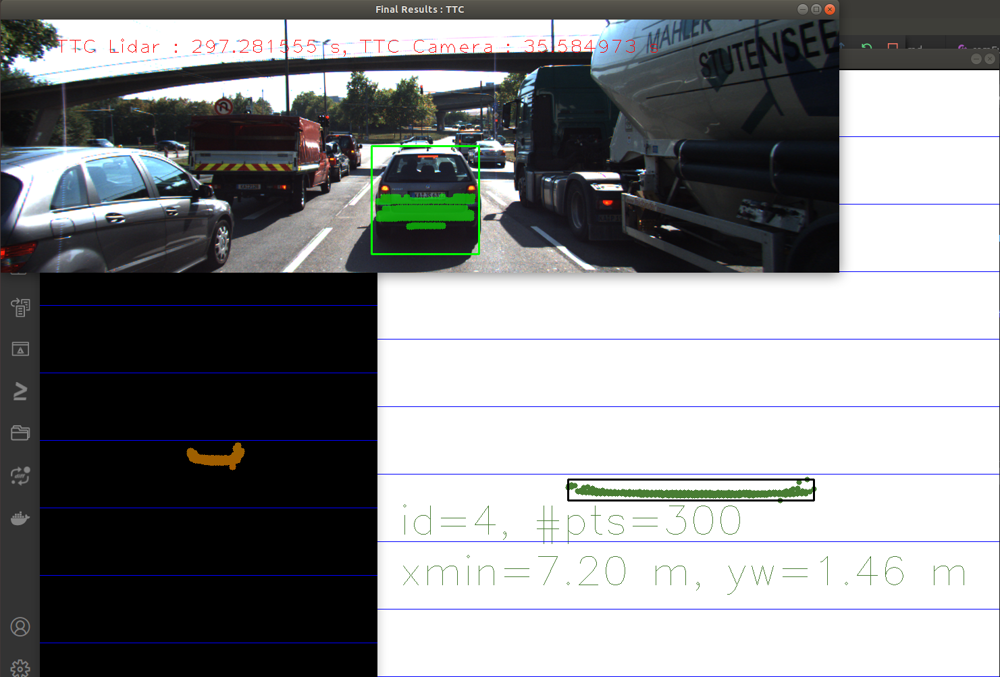
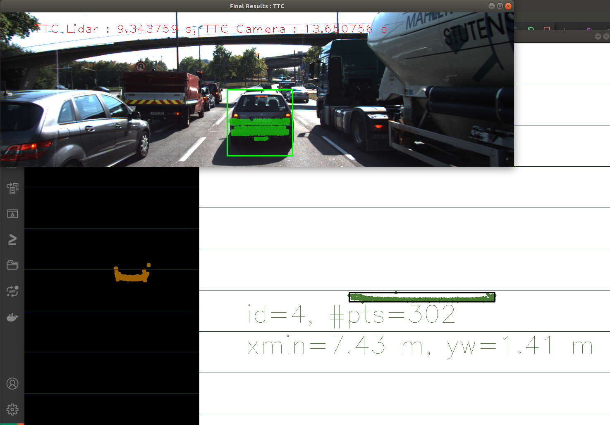

# SFND 3D Object Tracking

Welcome to the final project of the camera course. By completing all the lessons, you now have a solid understanding of keypoint detectors, descriptors, and methods to match them between successive images. Also, you know how to detect objects in an image using the YOLO deep-learning framework. And finally, you know how to associate regions in a camera image with Lidar points in 3D space. Let's take a look at our program schematic to see what we already have accomplished and what's still missing.


In this final project, you will implement the missing parts in the schematic. To do this, you will complete four major tasks: 
1. First, you will develop a way to match 3D objects over time by using keypoint correspondences. 
2. Second, you will compute the TTC based on Lidar measurements. 
3. You will then proceed to do the same using the camera, which requires to first associate keypoint matches to regions of interest and then to compute the TTC based on those matches. 
4. And lastly, you will conduct various tests with the framework. Your goal is to identify the most suitable detector/descriptor combination for TTC estimation and also to search for problems that can lead to faulty measurements by the camera or Lidar sensor. In the last course of this Nanodegree, you will learn about the Kalman filter, which is a great way to combine the two independent TTC measurements into an improved version which is much more reliable than a single sensor alone can be. But before we think about such things, let us focus on your final project in the camera course. 

## Dependencies for Running Locally
* cmake >= 2.8
  * All OSes: [click here for installation instructions](https://cmake.org/install/)
* make >= 4.1 (Linux, Mac), 3.81 (Windows)
  * Linux: make is installed by default on most Linux distros
  * Mac: [install Xcode command line tools to get make](https://developer.apple.com/xcode/features/)
  * Windows: [Click here for installation instructions](http://gnuwin32.sourceforge.net/packages/make.htm)
* Git LFS
  * Weight files are handled using [LFS](https://git-lfs.github.com/)
* OpenCV >= 4.1
  * This must be compiled from source using the `-D OPENCV_ENABLE_NONFREE=ON` cmake flag for testing the SIFT and SURF detectors.
  * The OpenCV 4.1.0 source code can be found [here](https://github.com/opencv/opencv/tree/4.1.0)
* gcc/g++ >= 5.4
  * Linux: gcc / g++ is installed by default on most Linux distros
  * Mac: same deal as make - [install Xcode command line tools](https://developer.apple.com/xcode/features/)
  * Windows: recommend using [MinGW](http://www.mingw.org/)

## Basic Build Instructions

1. Clone this repo.
2. Make a build directory in the top level project directory: `mkdir build && cd build`
3. Compile: `cmake .. && make`
4. Run it: `./3D_object_tracking`.

## Project Specification

### FP.1 Match 3D Objects

Implement the method "matchBoundingBoxes", which takes as input both the previous and the current data frames and provides as output the ids of the matched regions of interest (i.e. the boxID property). Matches must be the ones with the highest number of keypoint correspondences.

Implementation:

```
void matchBoundingBoxes(std::vector<cv::DMatch> &matches, std::map<int, int> &bbBestMatches, DataFrame &prevFrame, DataFrame &currFrame)
{
    for (auto prevBB : prevFrame.boundingBoxes)
    {
        std::vector<cv::DMatch> enclose;

        for (cv::DMatch match : matches)
        {
            int prevIdx = match.queryIdx;
            if (prevBB.roi.contains(prevFrame.keypoints.at(prevIdx).pt))
                enclose.push_back(match);
        }

        std::multimap<int, int> record;

        for (auto candidate : enclose)
        {
            int currIDx = candidate.trainIdx;
            for (auto currBB : currFrame.boundingBoxes)
            {
                if (currBB.roi.contains(currFrame.keypoints.at(currIDx).pt))
                    record.insert(std::pair<int, int>(currBB.boxID, currIDx));
            }
        }

        int maxOccurrences = 0;
        int index = 0;

        for (auto rec : record)
        {
            if (record.count(rec.first) > maxOccurrences)
            {
                maxOccurrences = record.count(rec.first);
                index = rec.first;
            }
        }

        bbBestMatches.insert(std::pair<int, int>(prevBB.boxID, index));
    }
}
```

### FP.2 Compute Lidar-based TTC

Compute the time-to-collision in second for all matched 3D objects using only Lidar measurements from the matched bounding boxes between current and previous frame.

```
void kNearestPointsMedianValue(vector<double> minXPVector, int& kNearest, double& medianValue)
{
    typedef vector<double>::size_type vec_sz;

    sort(minXPVector.begin(), minXPVector.end());
    vector<double> kNearestVector;
    kNearestVector.insert(kNearestVector.begin(), minXPVector.begin(), next(minXPVector.begin(), kNearest));

    vec_sz size = kNearestVector.size();
    vec_sz mid = size/2;

    medianValue = kNearest % 2 == 0 ? (kNearestVector[mid] + kNearestVector[mid-1]) / 2 : kNearestVector[mid];
}

void computeTTCLidar(std::vector<LidarPoint> &lidarPointsPrev,
                     std::vector<LidarPoint> &lidarPointsCurr, double frameRate, double &TTC)
{
    // auxiliary variables
    double dT = 0.1;        // time between two measurements in seconds
    double laneWidth = 4.0; // assumed width of the ego lane
    double scope = (laneWidth-0.2) / 2;
    std::vector<double> minXPrevList;
    std::vector<double> minXCurrList;

    auto checkFunc = [&scope](const LidarPoint &lp){return abs(lp.y) >= scope;};

    lidarPointsPrev.erase(std::remove_if(lidarPointsPrev.begin(), lidarPointsPrev.end(), checkFunc), lidarPointsPrev.end());
    lidarPointsCurr.erase(std::remove_if(lidarPointsCurr.begin(), lidarPointsCurr.end(), checkFunc), lidarPointsCurr.end());

    // find closest distance to Lidar points within ego lane
    double minXPrev = 1e9, minXCurr = 1e9;
    for (auto it = lidarPointsPrev.begin(); it != lidarPointsPrev.end(); ++it)
    {
        minXPrev = minXPrev > it->x ? it->x : minXPrev;
        minXPrevList.push_back(minXPrev);
    }

    for (auto it = lidarPointsCurr.begin(); it != lidarPointsCurr.end(); ++it)
    {
        minXCurr = minXCurr > it->x ? it->x : minXCurr;
        minXCurrList.push_back(minXCurr);
    }

    int kNearestPoints = 100;
    double kMinXCurr = 0;
    double kMinXPrev = 0;

    // kNearestPointsMeanValue(minXPrevList, kNearestPoints, kMinXCurr);
    // kNearestPointsMeanValue(minXCurrList, kNearestPoints, kMinXPrev);   

    kNearestPointsMedianValue(minXCurrList, kNearestPoints, kMinXCurr);
    kNearestPointsMedianValue(minXPrevList, kNearestPoints, kMinXPrev);

    // compute TTC from both measurements
    TTC = kMinXCurr * dT / (kMinXPrev - kMinXCurr);

    cout << "Median min current:  " << kMinXCurr << endl;
    cout << "Median min previous: " << kMinXPrev << endl;
    cout << "Lidar TTC: " << TTC << "s" << endl;
}

```

### FP.3 Associate Keypoint Correspondences with Bounding Boxes

Prepare the TTC computation based on camera measurements by associating keypoint correspondences to the bounding boxes which enclose them. All matches which satisfy this condition must be added to a vector in the respective bounding box.

```
void clusterKptMatchesWithROI(BoundingBox &boundingBox, std::vector<cv::KeyPoint> &kptsPrev, std::vector<cv::KeyPoint> &kptsCurr, std::vector<cv::DMatch> &kptMatches)
{
    std::vector<double> euclidian;

    for (cv::DMatch match : kptMatches)
    {
        int currIdx = match.trainIdx;
        if (boundingBox.roi.contains(kptsCurr[currIdx].pt))
        {
            int prevIdx = match.queryIdx;
            euclidian.push_back(cv::norm(kptsCurr[currIdx].pt - kptsPrev[prevIdx].pt));
        }
            
    }

    double euclidianMean = std::accumulate(euclidian.begin(), euclidian.end(), 0)/euclidian.size();

    for (cv::DMatch match : kptMatches)
    {
        int currIdx = match.trainIdx;
        if (boundingBox.roi.contains(kptsCurr[currIdx].pt))
        {
            int prevIdx = match.queryIdx;
            int distance = cv::norm(kptsCurr[currIdx].pt - kptsPrev[prevIdx].pt);

            if (distance <= euclidianMean)
            {
                boundingBox.keypoints.push_back(kptsCurr[currIdx]);
                boundingBox.kptMatches.push_back(match);
            }
        }
    }

    cout << "Mean value: " << euclidianMean << endl;
    cout << "Before filtering there are: " << euclidian.size() << endl;
    cout << "After filtering, there are: " << boundingBox.keypoints.size() << endl;
}

```

### FP.4 Compute Camera-based TTC

Compute the time-to-collision in second for all matched 3D objects using only keypoint correspondences from the matched bounding boxes between current and previous frame.

```
void computeTTCCamera(std::vector<cv::KeyPoint> &kptsPrev, std::vector<cv::KeyPoint> &kptsCurr, 
                      std::vector<cv::DMatch> kptMatches, double frameRate, double &TTC, cv::Mat *visImg)
{
    // compute distance ratios between all matched keypoints
    vector<double> distRatios; // stores the distance ratios for all keypoints between curr. and prev. frame
    for (auto it1 = kptMatches.begin(); it1 != kptMatches.end() - 1; ++it1)
    { // outer kpt. loop

        // get current keypoint and its matched partner in the prev. frame
        cv::KeyPoint kpOuterCurr = kptsCurr.at(it1->trainIdx);
        cv::KeyPoint kpOuterPrev = kptsPrev.at(it1->queryIdx);

        for (auto it2 = kptMatches.begin() + 1; it2 != kptMatches.end(); ++it2)
        { // inner kpt.-loop

            double minDist = 100.0; // min. required distance

            // get next keypoint and its matched partner in the prev. frame
            cv::KeyPoint kpInnerCurr = kptsCurr.at(it2->trainIdx);
            cv::KeyPoint kpInnerPrev = kptsPrev.at(it2->queryIdx);

            // compute distances and distance ratios
            double distCurr = cv::norm(kpOuterCurr.pt - kpInnerCurr.pt);
            double distPrev = cv::norm(kpOuterPrev.pt - kpInnerPrev.pt);

            if (distPrev > std::numeric_limits<double>::epsilon() && distCurr >= minDist)
            { // avoid division by zero

                double distRatio = distCurr / distPrev;
                distRatios.push_back(distRatio);
            }
        } // eof inner loop over all matched kpts
    }     // eof outer loop over all matched kpts

    // only continue if list of distance ratios is not empty
    if (distRatios.size() == 0)
    {
        TTC = NAN;
        return;
    }


    // STUDENT TASK (replacement for meanDistRatio)
    std::sort(distRatios.begin(), distRatios.end());
    long medIndex = floor(distRatios.size() / 2.0);
    double medDistRatio = distRatios.size() % 2 == 0 ? (distRatios[medIndex - 1] + distRatios[medIndex]) / 2.0 : distRatios[medIndex]; // compute median dist. ratio to remove outlier influence

    double dT = 1 / frameRate;
    TTC = -dT / (1 - medDistRatio);
    // EOF STUDENT TASK
}
```

### FP.5 Performance Evaluation 1

Find examples where the TTC estimate of the Lidar sensor does not seem plausible. Describe your observations and provide a sound argumentation why you think this happened.

1. example

0000000007.png \
Median min current:  7.555 \
Median min previous: 7.577 \
Lidar TTC: 34.3404s 



Explanation:
Current and previous distance are to close which cause TTC to rise, since in calculus divider is "kMinXPrev - kMinXCurr".

2. example

0000000010.png \
Median min current:  7.4315 \
Median min previous: 7.434 \
Lidar TTC: 297.282s 



Explanation:
The closer two values are (kMinXPrev - kMinXCurr), will make TTC to strive to infinit.

3. example

0000000012.png \
Median min current:  7.272 \
Median min previous: 7.205 \
Lidar TTC: -10.8537s 

Explanation:
In this case current distance is bigger then the previous which imply that vehicles will never colide therefore negativ value for TTC.

### FP.6 Performance Evaluation 2

Run several detector / descriptor combinations and look at the differences in TTC estimation. Find out which methods perform best and also include several examples where camera-based TTC estimation is way off. As with Lidar, describe your observations again and also look into potential reasons.

